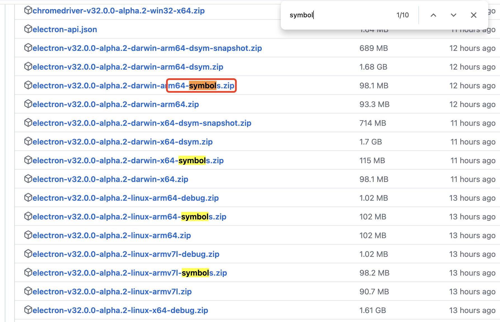

# electron dump cracker

> Used for parse dump file,find out the point.

## Usage

### Clone the repo

```sh
git clone https://github.com/rosendolu/electron-dump-cracker.git
```

### Download target [electron symbol](https://github.com/electron/electron/releases) file. The symbol files you need to use should **_correspond to the platform where the application was built and where the crash occurred_**.

1.  Electron version
2.  Operating system



### Modify symbol path

```javascript
const symbolPaths = path.join(
  __dirname,
  'electron-v27.0.3-win32-x64-symbols/breakpad_symbols'
);
```

### Exec the script

```javascript
npm run start
```

## Doc

### Breakpad

> `minidump` used

### Crashpad

1. **Install Necessary Tools**:
   Clone the Crashpad repository:

   ```bash
   git clone https://chromium.googlesource.com/crashpad/crashpad
   ```

2. **Build Crashpad**:
   Similar to Breakpad, here is an example build process for Linux:

   ```bash
   cd crashpad
   mkdir build
   cd build
   cmake ..
   make
   ```

   This will generate the necessary tools including `minidump_stackwalk`.

3. **Obtain Symbol Files**:
   As with Breakpad, you need the symbol files for your application.

4. **Parse the dmp File**:
   Use the tool to parse the dmp file:

   ```bash
   ./minidump_stackwalk <path-to-dmp-file> <path-to-symbols-directory> > output.txt
   ```

   This will output the parsed results to `output.txt`.

   Example

   ```bash
   ./minidump_stackwalk app.dmp symbols/ > crash_report.txt
   ```

Refer

1. [crash-reporter](https://www.electronjs.org/docs/latest/api/crash-reporter#crashreporteraddextraparameterkey-value)
2. [chromium.googlesource.com/crashpad](https://chromium.googlesource.com/crashpad/crashpad/+/refs/heads/main/README.md)

Versions:

1. [electron v27.0.3 symbols](https://github.com/electron/electron/releases?page=16)
